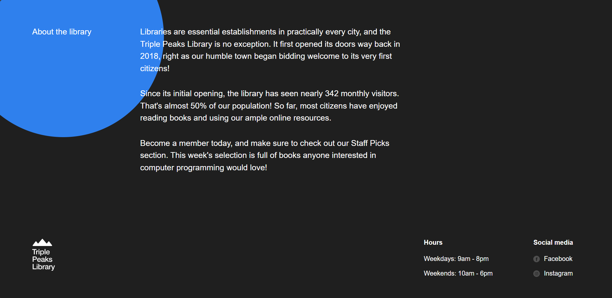
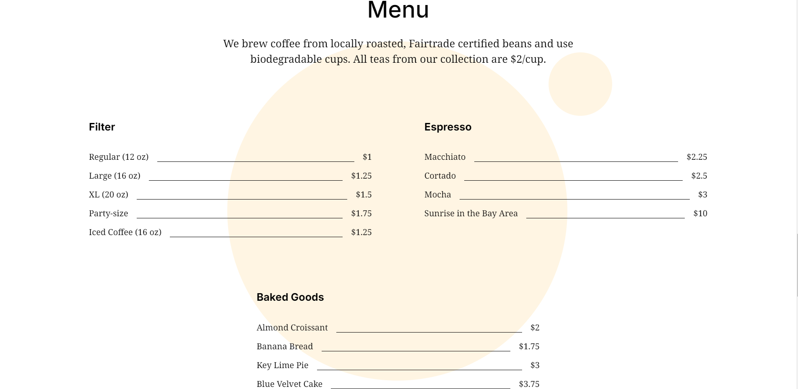

# Triple Peaks Library

## Description

The **Triple Peaks Library** is a responsive, single-page website designed as part of the TripleTen Software Engineering program. Built with semantic HTML5 and modern CSS techniques, it showcases a fictional library's offerings with a clean and accessible layout.

## Visuals

_Screenshot of the Triple Peaks Library homepage displaying the main banner and featured books section._

## How to View the Project

To preview the project on your local machine:

1. Download or clone the repository:

   git clone https://github.com/GoReala23/se_project_library.git

2. Open the project folder in **VS Code**.

3. Make sure the **Live Server** extension is installed.

4. Right-click on `index.html` and select **“Open with Live Server”**, or click **“Go Live”** in the bottom-right corner of VS Code.

This will launch the site in your browser and simulate a real-time environment for testing and demonstration.

## Demo Video

Watch a walkthrough of the project:  
👉 [Triple Peaks Library Demo Video](https://www.youtube.com/watch?v=your-demo-video-link)

## Technologies Used

- HTML5
- CSS3

## System Requirements

- A modern web browser (e.g., Chrome, Firefox, Safari)
- **VS Code** with the **Live Server** extension installed

## Future Improvements

- **Enhance accessibility** using ARIA roles to improve support for assistive technologies.
- **Implement fully responsive design** using CSS Grid and `clamp()` for typography to better support various screen sizes.
- **Add interactivity** with JavaScript for a more dynamic user experience.
